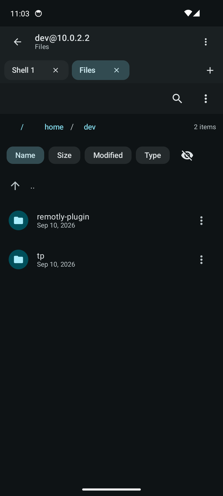

# Remotly

A native SSH and SFTP client for Android, with optional Herdr workspace control.

[](https://github.com/heavycaffeiner/Remotly/releases/latest)
[](https://github.com/heavycaffeiner/Remotly/releases/latest)
[](LICENSE)

Remotly connects directly to an SSH host. It does not require a relay, cloud
account, or Remotly service on the server. Herdr integration is optional and
uses an existing Herdr installation on the host.

## Screenshots

| Hosts | Terminal |
| --- | --- |
|  |  |

| Files | Herdr workspaces |
| --- | --- |
|  |  |

## Install

1. Download `app-release.apk` from the [latest release](https://github.com/heavycaffeiner/Remotly/releases/latest).
2. Install the APK on an Android device.
3. Add a host and accept its host key on the first connection.

Requirements:

- Android 7.0 or later (API 24+)
- ARMv7, ARM64, or x86_64
- An SSH server reachable from the device

Updates must be signed with the same key as the installed APK. Install releases
from this repository to keep the signing identity consistent.

## Features

### Terminal

- Multiple shell tabs per host
- Login-shell startup, including the host's normal `PATH` and shell setup
- Sessions that remain connected while navigating elsewhere in the app
- Korean and other CJK input without waiting for a whole word to commit
- Bracketed paste, OSC 52 clipboard writes, OSC 8 links, and bare URL detection
- OSC 9 and OSC 777 notifications
- Kitty graphics protocol images rendered in the terminal grid
- Configurable font size, cursor style, haptics, and an extra terminal key row
- Image selection that uploads to `~/.remotly/` and inserts the remote path

### Files

- SFTP browsing in tabs beside shell sessions
- Full-directory search, sorting, hidden-file control, and breadcrumbs
- Uploads and downloads through Android's document picker
- Transfer progress that remains visible across screens
- Resume support where the remote and local files can be verified safely
- Explicit conflict handling instead of silent replacement

### Herdr workspaces

- Browse Herdr sessions, workspaces, and tabs from a host sidebar
- Attach a terminal to the focused workspace
- Create, rename, focus, and close workspaces and tabs
- Follow workspace and tab changes made from another Herdr client
- Swipe across the terminal to change tabs
- Double tap the terminal to move to the next workspace
- Select and upload images from the workspace terminal

The optional plugin adds actions that need the focused pane as context:

- Open a tab in the focused pane's current directory
- Move the focused tab's panes into separate tabs
- Toggle focused-pane zoom

## Herdr setup

Herdr workspace browsing requires Herdr 0.9.0 or later and a running
`herdr server` on the SSH host.

Install the optional Remotly Bridge plugin for the pane-aware actions:

```sh
herdr plugin install heavycaffeiner/Remotly/plugin
herdr plugin action list --plugin remotly.bridge
```

The first host-key decision must be made from a normal terminal connection.
Herdr control commands use non-interactive SSH channels, which cannot present
the first-use host-key prompt.

See [`plugin/README.md`](plugin/README.md) for plugin actions and local linking.

## Security model

- SSH and SFTP traffic goes directly between the device and the configured host.
- Host keys use trust on first use and are pinned per saved host.
- A changed host key blocks the connection until the user confirms it.
- Release signing keys and passwords are not stored in the repository.
- A release build without signing credentials stays unsigned and cannot be
  installed as a published update.

## Build from source

### Requirements

| Tool | Version |
| --- | --- |
| JDK | 17 or later |
| Android SDK | compile SDK 37, build-tools 37.0.0 |
| Android NDK | 28.2.13676358 |
| Go | 1.26 or later |
| gomobile | Installed by `scripts/build-sshcore.sh` |
| Zig | Only required to rebuild the terminal native library |

Set `ANDROID_HOME` before building the Go SSH core. Set `ANDROID_NDK_HOME` or
install the configured NDK under the Android SDK.

```sh
git clone https://github.com/heavycaffeiner/Remotly.git
cd Remotly

export ANDROID_HOME=/path/to/android-sdk
scripts/build-sshcore.sh

cd app/android
./gradlew assembleDebug
```

The debug APK is written to:

```text
app/android/app/build/outputs/apk/debug/app-debug.apk
```

Install it on a connected device:

```sh
cd app/android
./gradlew installDebug
```

## Checks

Run every host-side check:

```sh
scripts/check.sh
```

Useful variants:

```sh
scripts/check.sh --fast       # repository checks and Go tests, no Gradle
scripts/check.sh --release    # also build and inspect the release APK
GRADLE_ONLINE=1 scripts/check.sh  # allow dependency resolution
```

The standard check covers repository hygiene, Kotlin unit tests, a debug APK,
and the Go modules under `mobile/`.

## Release process

The version comes from `app/android/gradle.properties`. Pushing a `v*` tag
runs the GitHub release workflow, builds a signed APK, verifies its signature,
and attaches it to the matching GitHub release.

Local signed distributions can be built with `scripts/release.sh`. Signing
configuration and APK inspection details are documented in
[`app/README.md`](app/README.md).

## Repository layout

| Path | Purpose |
| --- | --- |
| `app/android/app/` | Android application, Kotlin, Jetpack Compose, and Material 3 |
| `app/android/terminal-native/` | JNI bridge and host tests for libghostty-vt |
| `mobile/sshcore/` | Go SSH and SFTP implementation built as an Android AAR |
| `plugin/` | Optional Herdr plugin used by workspace terminal actions |
| `scripts/` | Toolchain checks, builds, release packaging, and APK inspection |
| `docs/` | Design notes, internal verification records, and images |

More implementation detail is available in [`app/README.md`](app/README.md).

## License

[MIT](LICENSE)
