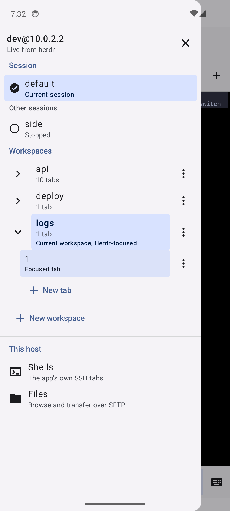

# Remotly

A standalone SSH and SFTP client for Android.

| Hosts | Terminal | Herdr workspaces |
| --- | --- | --- |
|  |  |  |

## What it does

- **SSH and SFTP, no server side.** Add a host and connect directly: several
  terminal tabs per host, host-key verification on first use, and file
  transfer in both directions.
- **Full shell environment.** Every session starts from a login shell, so
  PATH, aliases, functions, and version managers (nvm, pyenv, asdf) are all
  present.
- **CJK input.** Korean input commits one syllable at a time rather than one
  word, so a TUI reading keys as they arrive behaves the way it does on a
  desktop terminal.
- **Inline images.** The Kitty graphics protocol renders images in the grid,
  so a tool that draws one has somewhere to draw it.
- **Desktop notifications.** A program can raise one with OSC 9 or OSC 777,
  which is how a long build says it finished.
- **Clipboard.** Tapping a link copies it, OSC 8 or bare URL alike. A program
  can write the clipboard with OSC 52, and a multi-line paste arrives as one
  block through bracketed paste rather than as a run of Enter keys.
- **Image paste.** Pick an image and it uploads over SFTP, then types the
  remote path, which is what an agent reading files from disk expects.
- **Herdr workspaces.** Where herdr is installed on the host and `herdr
  server` is running, its workspaces and tabs are listed, created, renamed,
  focused, and closed from the app over SSH. They keep running on the machine,
  so closing Remotly or losing the connection leaves every workspace where it
  was. Verified against herdr 0.9.0; the wire format has been stable since
  0.8.2.

## Layout

| Path | What it is |
| --- | --- |
| `app/` | React Native app (Android; iOS builds but is not feature-complete) |
| `app/android/terminal-native/` | JNI bridge to libghostty-vt, the terminal core |
| `mobile/sshcore/` | Go SSH and SFTP core, built as an AAR for the app |

## Security

Host keys are verified on first use (TOFU) and pinned per host. If a host's
key later changes, the app refuses to connect until the change is confirmed.

The herdr screen runs each command as its own one-shot SSH exec, which has
nowhere to show the first-use prompt, so a host is unreachable there until its
key has been accepted in the terminal once. The screen says so and offers the
way in.

## Building

Requires JDK 17 or later, the Android SDK with an NDK, Go 1.26, Node 22+, and
pnpm. `scripts/check-toolchain.sh` verifies the set.

The app links a Go SSH/SFTP core built with gomobile. It is a build output
rather than a checked-in binary, so a fresh clone builds it once before Gradle
can resolve it:

```sh
# Produces app/android/app/libs/sshcore.aar. Needed again only after a change
# under mobile/sshcore.
scripts/build-sshcore.sh

# Everything that runs without a device.
scripts/check.sh

# Debug APK.
cd app/android && ./gradlew assembleDebug
```

### Release builds

Release signing credentials are never committed. Provide them through
`app/android/keystore.properties`:

```properties
storeFile=/absolute/path/to/release.jks
storePassword=...
keyAlias=...
keyPassword=...
```

or through the environment, which is what CI uses:

```sh
export REMOTLY_KEYSTORE=/absolute/path/to/release.jks
export REMOTLY_KEYSTORE_PASSWORD=...
export REMOTLY_KEY_ALIAS=...
export REMOTLY_KEY_PASSWORD=...
cd app/android && ./gradlew assembleRelease
```

Without credentials the release task still runs and produces
`app-release-unsigned.apk`, which fails to install. That is deliberate: a release must
never be signed with the debug key, which is shared and committed so debug builds stay
reproducible.

### CI signing

The release workflow signs from repository secrets, so no key material lives on a
developer machine or in the repository. Register these under
**Settings > Secrets and variables > Actions**:

| Secret | Value |
| --- | --- |
| `REMOTLY_KEYSTORE_BASE64` | `base64 -w0 release.jks` |
| `REMOTLY_KEYSTORE_PASSWORD` | Keystore password |
| `REMOTLY_KEY_ALIAS` | Key alias |
| `REMOTLY_KEY_PASSWORD` | Key password |

The keystore is decoded to the runner's temp directory, outside the working tree, and
deleted when the job ends. Secrets reach Gradle through the environment rather than the
command line, because an expression expanded into a `run:` script appears in the log
before masking applies. The signature is verified but not printed, since
`apksigner --print-certs` would write the signing identity into a public build log.

Losing the release key means no existing install can ever be updated. Back it up
somewhere durable and outside this repository.

### Release artifacts

Pushing a `v*` tag builds and attaches to the GitHub release:

| Artifact | What it is |
| --- | --- |
| `app-release.apk` | Signed Android app |

`scripts/release.sh` builds the same signed APK locally, alongside a
`SHA256SUMS` file for verification.

## License

MIT. See [LICENSE](LICENSE).
