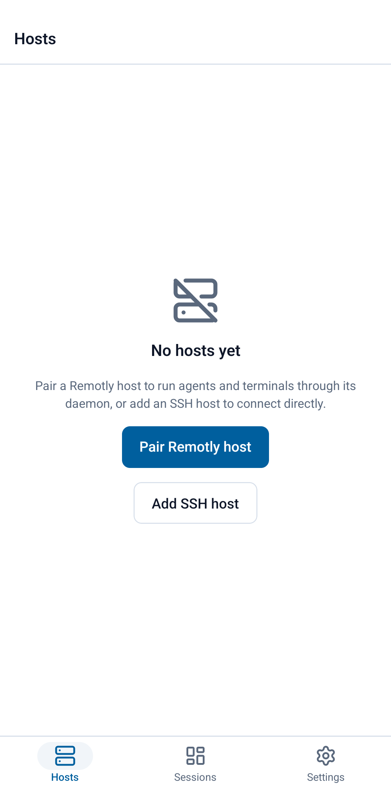
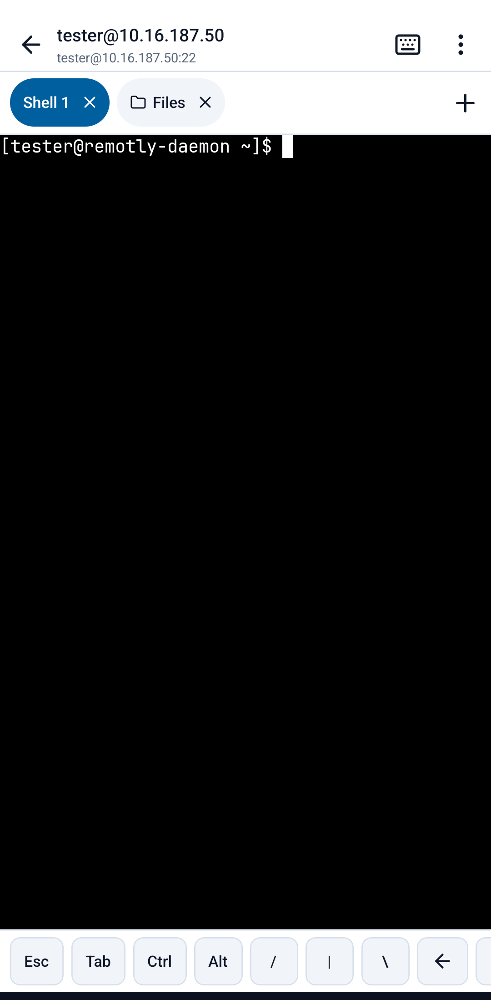

# Remotly

Remote development companion. A Go daemon runs on your development machine and keeps
terminal sessions alive; an Android app connects to it to run coding agents and remote
terminals, and doubles as a standalone SSH and SFTP client.

Sessions outlive the app. Closing the phone, losing the network, or switching hosts does
not kill a running shell: the daemon owns the PTY and the app reattaches with a replay
cursor, so the scrollback is there when it comes back.

| Hosts | Terminal |
| --- | --- |
|  |  |

## What it does

- **Pairing by QR code or link.** A one-time token carries the daemon's public key; the
  app pins that identity and never stores the pairing secret.
- **Persistent sessions.** Shells and agents keep running on the daemon. The app attaches,
  detaches, and reattaches without interrupting them.
- **Full shell environment.** Every session starts from a login shell, so PATH, aliases,
  functions, and version managers (nvm, pyenv, asdf) are all present.
- **Standalone SSH and SFTP.** Plain SSH hosts work with no daemon: multiple tabs per
  host, host-key verification on first use, and file transfer in both directions.
- **CJK input.** Korean input commits one syllable at a time rather than one word, so a
  TUI reading keys as they arrive behaves the way it does on a desktop terminal.

## Layout

| Path | What it is |
| --- | --- |
| `app/` | React Native app (Android; iOS builds but is not feature-complete) |
| `app/android/terminal-native/` | JNI bridge to libghostty-vt, the terminal core |
| `daemon/` | The daemon: PTY sessions, transport, file transfer |
| `relay/` | Optional relay for hosts that are not reachable directly |
| `mobile/sshcore/` | Go SSH and SFTP core, built as an AAR for the app |
| `docs/protocol.md` | Wire protocol, normative |
| `docs/relay.md` | Running a self-hosted relay |

## Security

The transport is Noise (XXpsk0 for pairing, IK afterwards) over a WebSocket, with
ChaCha20-Poly1305 framing. The app pins the daemon's static key at pairing and refuses a
changed key.

Cleartext is permitted on the outer socket because the payload is already sealed end to
end and a daemon on a private network has no CA-issued certificate. Nothing in the app
trusts the transport layer for authentication.

## Building

Requires JDK 21, the Android SDK, Go 1.26, Node 22+, and pnpm.

```sh
# Everything that runs without a device.
scripts/check.sh

# Debug APK.
cd app/android && ./gradlew assembleDebug
```

### Release builds

Release signing credentials are never committed. Provide them through
`app/android/keystore.properties`:

```properties
storeFile=/absolute/path/to/release.jks
storePassword=...
keyAlias=...
keyPassword=...
```

or through the environment, which is what CI uses:

```sh
export REMOTLY_KEYSTORE=/absolute/path/to/release.jks
export REMOTLY_KEYSTORE_PASSWORD=...
export REMOTLY_KEY_ALIAS=...
export REMOTLY_KEY_PASSWORD=...
cd app/android && ./gradlew assembleRelease
```

Without credentials the release task still runs and produces
`app-release-unsigned.apk`, which fails to install. That is deliberate: a release must
never be signed with the debug key, which is shared and committed so debug builds stay
reproducible.

### CI signing

The release workflow signs from repository secrets, so no key material lives on a
developer machine or in the repository. Register these under
**Settings > Secrets and variables > Actions**:

| Secret | Value |
| --- | --- |
| `REMOTLY_KEYSTORE_BASE64` | `base64 -w0 release.jks` |
| `REMOTLY_KEYSTORE_PASSWORD` | Keystore password |
| `REMOTLY_KEY_ALIAS` | Key alias |
| `REMOTLY_KEY_PASSWORD` | Key password |

The keystore is decoded to the runner's temp directory, outside the working tree, and
deleted when the job ends. Secrets reach Gradle through the environment rather than the
command line, because an expression expanded into a `run:` script appears in the log
before masking applies. The signature is verified but not printed, since
`apksigner --print-certs` would write the signing identity into a public build log.

Losing the release key means no existing install can ever be updated. Back it up
somewhere durable and outside this repository.

### Release artifacts

Pushing a `v*` tag builds and attaches to the GitHub release:

| Artifact | What it is |
| --- | --- |
| `app-release.apk` | Signed Android app |
| `remotly-linux-amd64`, `remotly-linux-arm64` | Daemon |
| `remotly-relay-linux-amd64`, `remotly-relay-linux-arm64` | Relay |
| `SHA256SUMS` | Checksums for the binaries |

The Go binaries are statically linked with CGO disabled, so they run on any glibc
or musl host of the matching architecture. `scripts/release.sh` builds the same
set locally, plus darwin and windows targets.

## License

MIT. See [LICENSE](LICENSE).
